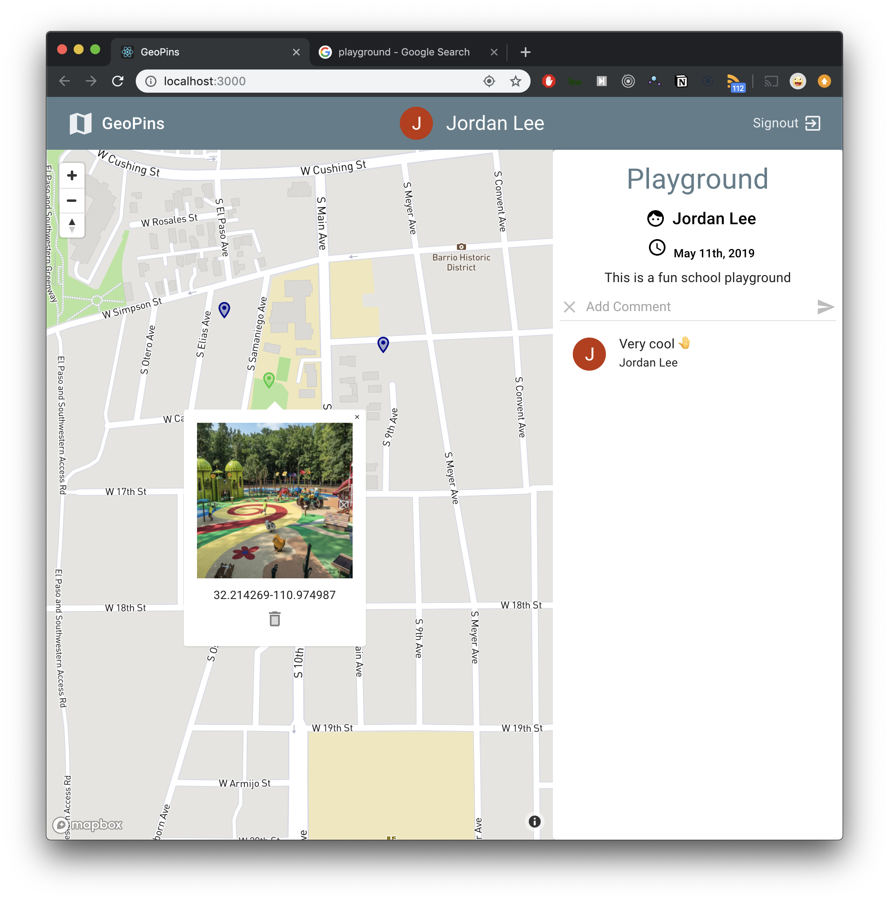
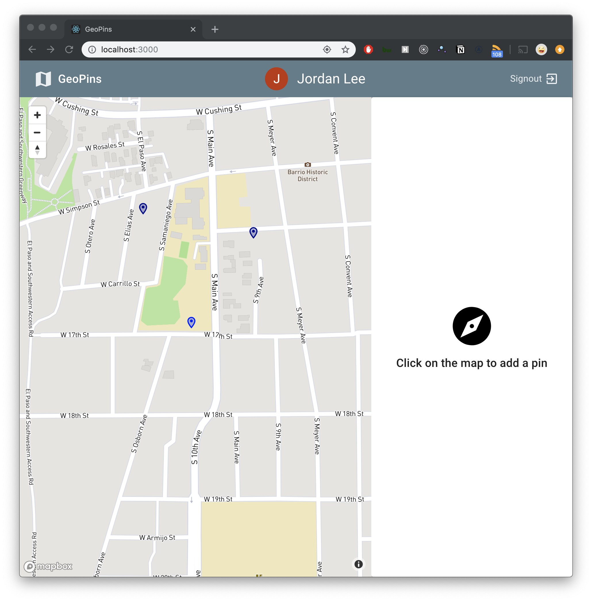
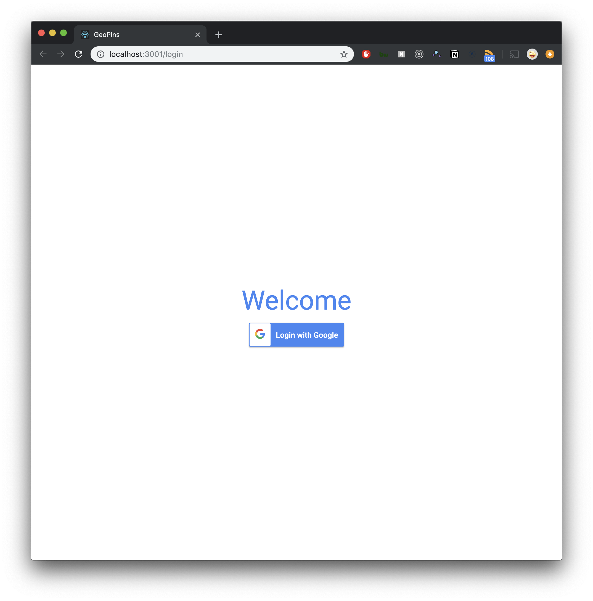

# GeoPins

A follow-along project from [Reed Barger's course](https://www.udemy.com/build-a-realtime-app-with-react-hooks-and-graphql/learn/v4/overview)

🛠 Tools Used

- React
- React Hooks
- GraphQL with Apollo
- MongoDB
- Google OAuth

⭐️ Features

- Live updates with GraphQL Subscriptions
- Automatic Signup and Login with Google

# Install and Run

```bash
git clone https://github.com/JLee21/react-graphql-geopins.git
cd react-graphql-geopins

# Create MongoDB URI and Google's OAuth Client ID inside a file .env
MONGO_URI=<goes here>
OAUTH_CLIENT_ID=<goes here>

yarn install
yarn dev

cd client
yarn install
yarn start
```




